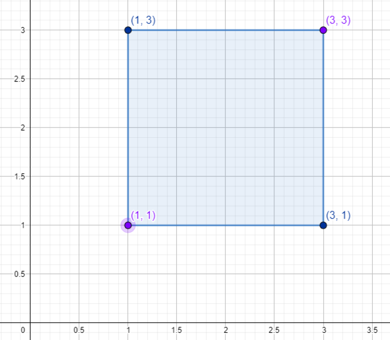
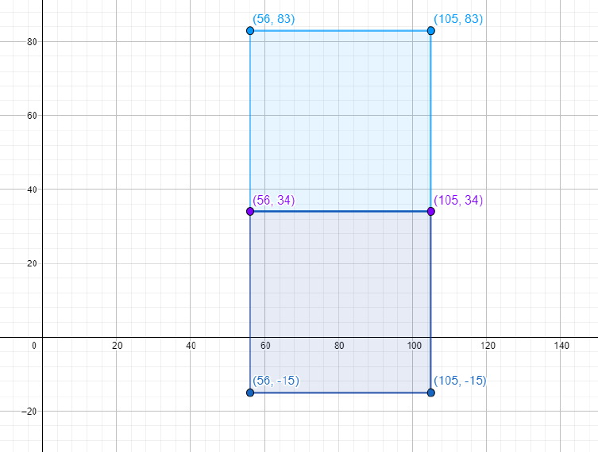

# Feladat [HU]
A versenyzők gyakran kérdezik tőlünk, Mi a négyzet?, de alig valaki kérdezi, hogy: Hogy van a négyzet? Ebben a feladatban egy harmadik kérdést kell hogy megválaszoljatok: ha adottak két egymástól különböző pont koordinátái, hány olyan négyzet létezik, melyeknek ez a két pont a négyzet csúcsai, és a négyzet oldalai pedig párhuzamosak a koordináta-rendszer valamelyik tengelyével ( x = 0 tengellyel, vagy y = 0 tengellyel)?

Gyakori kérdések:
- Kérdés: Hogy van a négyzet?
- Válasz: Jól van, köszöni a kérdését.
- Kérdés: Mi a négyzet?
- Válasz: Hogy nem szégyelli magát!

## Bemenet
A bemenet első sorában két egész szám x1 és y1− az első pont koordinátái állnak. A bemenet második sorában szintén két egész szám x2 és y2− a második pont koordinátái állnak.

## Kimenet
A kimenet egyetlen sorában kiíratni a négyzetek számát, amelyekre érvényes, hogy éleikpárhuzamosak a koordináta-rendszer tengelyeivel, és az adott pontok pedig a csúcsaik!

## Korlátozások
- -10^9 ≤ x1, y1, x2, y2 ≤ 10^9
- A pontok különböznek, vagyis nem érvényes, hogy x1 = x2 i y1 = y2. 
- A tesztpéldák 3 független csoportba oszthatóak:
    - Tesztpéldák, melyek 20 pontot érnek: -50 ≤ x1, y1, x2, y2 ≤ 50.
    - Tesztpéldák, melyek 30 pontot érnek: -200^9 ≤ x1, y1, x2, y2 ≤ 200.
    - Tesztpéldák, melyek 50 pontot érnek: nincs külön korlátozás.
## Példák
### Példa 1
- Bemenet
    - 1 1
        
        3 3
- Kimenet
    - 1
- Magyarázat
    - Az egyetlen megfelelő négyzet a {(1,1),(3,3),(1,3),(3,1)}:
    
### Példa 2
- Bemenet
    - 56 34

		105 34
- Kimenet
    - 2
- Magyarázat
    - Két megfelelő négyzet létezik a {(56,34), (105,34), (56,83), (105,83)} és {(56,34), (105,34), (56,-15), (105,-15)}:
    