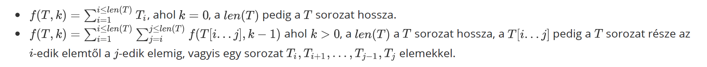

# Feladat [HU]
A „Legjobbak ltd." vállalat JAG™ nevű játékának sikerén felbuzdulva elkészítette annak folytatását, a még érdekesebb BUG™-ot.

Ebben a játékban 10^9+7 játékos vesz részt, a győztes kiválasztása véletlenszerűen történik. Hogy a döntés valóban véletlenszerűen történjen a vállalat szigorú feltételekhez kötötte az adott versenyző kiválasztását. Először is 0-tól 10^9+6-ig terjedő azonosító számokkal látják el a versenyzőket. Ezután kiválasztásra kerül az A sorozat N elemmel és a k szám. Ezután meghatározzák a győztest, azt a játékost, akinek identifikációs száma f(A,k) mod(10^9+7) ahol:

Segítsetek a "Legjobbak Ltd." vállalatnak, és határozzátok meg a verseny győztesét!
## Bemenet
Az első sorban az N(az A sorozat hossza) és a k számok állnak. A következő sorban N szám áll. Ezek az A sorozat elemei.

## Kimenet
A szabványos kimenet egyetlen sorában kiíratni egyetlen értéket, a játék győztesét, vagyis az f(A,k) mod(10^9 + 7) értéket!

## Korlátozások
- 1 ≤ N ≤ 2*10^5.
- 0 ≤ k ≤ 2*10^5.
- 0 ≤ Ai ≤ 10^9.
- Az tesztpéldák 5 független csoportba oszthatók:
    - Tesztpéldák, melyek 10 pontot érnek: N ≤ 10^3, k = 1.
    - Tesztpéldák, melyek 15 pontot érnek: N ≤ 5, k ≤ 5.
    - Tesztpéldák, melyek 25 pontot érnek: N ≤ 300, k ≤ 300.
    - Tesztpéldák, melyek 40 pontot érnek: N ≤ 2000, k ≤ 2000.
    - Tesztpéldák, melyek 10 pontot érnek: nincs külön korlátozás.
## Példák
### Példa 1
- Bemenet
    - 5 0

        1 6 3 4 7

- Kimenet
    - 21
- Magyarázat
    - f(A,k)=f([1,6,3,4,7],0)=1+6+3+4+7=21, akkor f(A,k) mod(10^9+7)=21.
### Példa 2
- Bemenet
    - 5 1

        1 6 3 4 7
- Kimenet
    - 147
- Magyarázat
    - f(A,k)=f([1,6,3,4,7],1)=f([1],0)+f([1,6],0)+f([1,6,3],0)+f([1],0)+f([1,6,3,4],0)+f([1,6,3,4,7],0)+f([6],0)+f([6,3],0)+f([6,3,4],0)+f([6,3],0), tehát |f(A,k) mod(10^9+7) = 147.